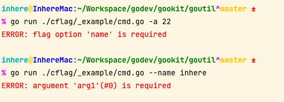

# cflag

`cflag` - Wraps and extends go `flag.FlagSet` to build simple command line applications

- Supports auto-rendering of pretty help messages
- Allows adding short options to flag options, and multiples
- Allows binding named parameters
- Allows setting arguments or options as required
- Allows setting validators for arguments or options

> **[中文说明](README.zh-CN.md)**

## Install

```shell
go get github.com/gookit/goutil/cflag
```

## Usage

Examples, code please see [_example/cmd.go](_example/cmd.go)

```go
package main

import (
	"github.com/gookit/goutil/cflag"
	"github.com/gookit/goutil/cliutil"
)

var opts = struct {
    age  int
    name string
    str1 string
    lOpt string
    bol  bool
}{}

// go run ./_example/cmd.go
// go run ./cflag/_example/cmd.go -h
// go run ./cflag/_example/cmd.go --name inhere --lo val ab cd
func main() {
	c := cflag.New(func(c *cflag.CFlags) {
		c.Desc = "this is a demo command"
		c.Version = "0.5.1"
	})
	c.IntVar(&opts.age, "age", 0, "this is a int option;;a")
	c.StringVar(&opts.name, "name", "", "this is a string option and required;true")
	c.StringVar(&opts.str1, "str1", "def-val", "this is a string option with default value;;s")
	c.StringVar(&opts.lOpt, "long-opt", "", "this is a string option with shorts;;lo")

	c.AddArg("arg1", "this is arg1", true, nil)
	c.AddArg("arg2", "this is arg2", true, nil)

	c.Func = func(c *cflag.CFlags) error {
		cliutil.Magentaln("hello, this is command:", c.Name())
		cliutil.Infoln("option.age =", opts.age)
		cliutil.Infoln("option.name =", opts.name)
		cliutil.Infoln("option.str1 =", opts.str1)
		cliutil.Infoln("option.lOpt =", opts.lOpt)
		cliutil.Infoln("arg1 =", c.Arg("arg1").String())
		cliutil.Infoln("arg2 =", c.Arg("arg2").String())
		cliutil.Infoln("remain args =", c.RemainArgs())

		return nil
	}

	// c.MustParse(os.Args[1:])
	c.MustParse(nil)
}
```

## Bind and get arguments

Bind arguments:

```go
	c.AddArg("arg1", "this is arg1", true, nil)
	c.AddArg("arg2", "this is arg2", true, nil)
```

Get arguments by name:

```go
	cliutil.Infoln("arg1 =", c.Arg("arg1").String())
	cliutil.Infoln("arg2 =", c.Arg("arg2").String())
```

## Set `required` and short options

Options can be set as `required`, and **short** option names can be set.

> TIPs: Implements `required` and `shorts` by extending `usage` with options parsed

**Format**:

- format1: `desc;required`
- format2: `desc;required;shorts`
- required: a bool string. mark option is required
  - True: `true,on,yes`
  - False: `false,off,no,''`
- shorts: shortcut names for option, allow multi values, split by comma `,`

**Examples**:

```go
    // set option 'name' is required
	c.StringVar(&opts.name, "name", "", "this is a string option and required;true")
    // set option 'str1' shorts: s
	c.StringVar(&opts.str1, "str1", "def-val", "this is a string option with default value;;s")
```

## Show help

```shell
go run ./cflag/_example/cmd.go -h
```

**Output**:


## Run command

```shell
go run ./cflag/_example/cmd.go --name inhere -a 12 --lo val ab cd
go run ./cflag/_example/cmd.go --name inhere -a 12 --lo val ab cd de fg
```

**Output**:


## `required` Check

```shell
go run ./cflag/_example/cmd.go -a 22
go run ./cflag/_example/cmd.go --name inhere
```

**Output**:



