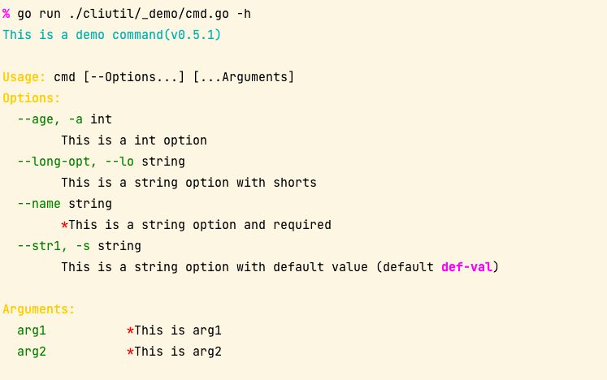
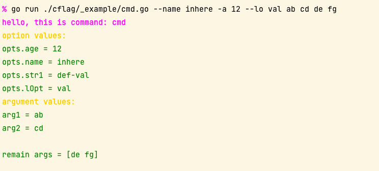

# cflag

`cflag` - 包装和扩展 Go `flag.FlagSet` 以构建简单的命令行应用程序

- 使用跟 Go `flag` 一样简单
- 支持自动渲染漂亮的帮助信息
- 允许为标志选项添加短选项,并且允许多个
- 允许绑定命名参数
- 允许设置参数或选项为必须
- 允许设置参数或选项的验证器

> **[EN Readme](README.md)**

## 安装

```shell
go get github.com/gookit/goutil/cflag
```

## Go docs

- [Go docs](https://pkg.go.dev/github.com/gookit/goutil/cflag)

## 使用

例子，代码请看 [_example/cmd.go](_example/cmd.go)

```go title="cflag/_example/cmd.go"
package main

import (
	"github.com/gookit/goutil/cflag"
	"github.com/gookit/goutil/cliutil"
)

var opts = struct {
    age  int
    name string
    str1 string
    lOpt string
    bol  bool
}{}

// go run ./_example/cmd.go
// go run ./cflag/_example/cmd.go -h
// go run ./cflag/_example/cmd.go --name inhere --lo val ab cd
func main() {
	c := cflag.New(func(c *cflag.CFlags) {
		c.Desc = "this is a demo command"
		c.Version = "0.5.1"
	})
	c.IntVar(&opts.age, "age", 0, "this is a int option;;a")
	c.StringVar(&opts.name, "name", "", "this is a string option and required;true")
	c.StringVar(&opts.str1, "str1", "def-val", "this is a string option with default value;;s")
	c.StringVar(&opts.lOpt, "long-opt", "", "this is a string option with shorts;;lo")

	c.AddArg("arg1", "this is arg1", true, nil)
	c.AddArg("arg2", "this is arg2", true, nil)

	c.Func = func(c *cflag.CFlags) error {
		cliutil.Magentaln("hello, this is command:", c.Name())
		cliutil.Infoln("option.age =", opts.age)
		cliutil.Infoln("option.name =", opts.name)
		cliutil.Infoln("option.str1 =", opts.str1)
		cliutil.Infoln("option.lOpt =", opts.lOpt)

		cliutil.Infoln("arg1 =", c.Arg("arg1").String())
		cliutil.Infoln("arg2 =", c.Arg("arg2").String())
		cliutil.Infoln("remain args =", c.RemainArgs())

		return nil
	}

	// c.MustParse(os.Args[1:])
	c.MustParse(nil)
}
```

## 设置必须和短选项

可以设置选项为 `required` 必填项，并且支持设置 **短选项** 名称。

> TIPs: 通过扩展解析了选项的 `usage` 来实现 `required` 和 `shorts`

### `usage` 格式

- 默认：`desc`
- 格式1: `desc;required`
- 格式2: `desc;required;shorts`
- `required`: 一个布尔字符串。标记选项是必需的
  - True: `true,on,yes`
  - False: `false,off,no,''`
- `shorts`: 选项的快捷方式名称，允许多值，用逗号 `,` 分隔

**示例**:

```go
    // set option 'name' is required
	c.StringVar(&opts.name, "name", "", "this is a string option and required;true")
    // set option 'str1' shorts: s
	c.StringVar(&opts.str1, "str1", "def-val", "this is a string option with default value;;s")
```

## 绑定和获取参数

绑定参数信息

```go
	c.AddArg("arg1", "this is arg1", true, nil)
	c.AddArg("arg2", "this is arg2", true, nil)
```

获取参数信息

```go
	cliutil.Infoln("arg1 =", c.Arg("arg1").String())
	cliutil.Infoln("arg2 =", c.Arg("arg2").String())
```

## 显示帮助信息

```shell
go run ./cflag/_example/cmd.go -h
```

**Output**:



## 运行命令

```shell
go run ./cflag/_example/cmd.go --name inhere -a 12 --lo val ab cd
go run ./cflag/_example/cmd.go --name inhere -a 12 --lo val ab cd de fg
```

**Output**:



## `required` 检查

```shell
go run ./cflag/_example/cmd.go -a 22
go run ./cflag/_example/cmd.go --name inhere
```

**Output**:


